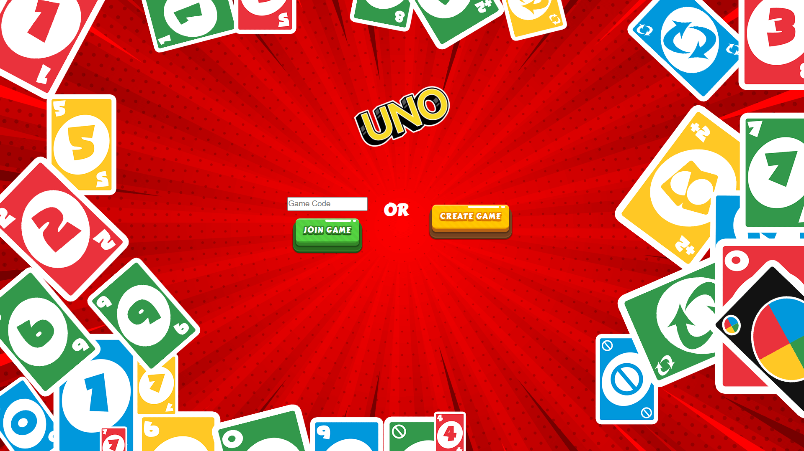

<h1 align="center">UNO ONLINE</h1>
<h3 align="center">Two player online game of UNO.</h3>

## 🤔 What is UNO?

UNO is the classic and beloved card game that’s easy to pick up and impossible to put down! Players take turns matching a card in their hand with the current card shown on top of the deck either by color or number. Special action cards deliver game-changing moments as they each perform a function to help you defeat your opponents. These include Skips, reverses, draw twos, color-changing wild and draw four wild cards.

## ⚠️ Game Rules

Read the complete rules of UNO [here]('https://www.unorules.com/).

## ❓ About the game

This two-player online version of the game was built with React, Socket.IO, Express and Node.js.

## 🧐 How to play?

1. Once you're on the homepage of the game, you can either host a new game or join a friend's game.
2. To host a new game, click on CREATE GAME. A game code will be generated which you can share with your friend.
3. To join a friend's game, enter the game code given by them, and click on JOIN GAME.
4. That's it! Enjoy the game and do not get toxic! 😄

## 🎮 Screenshots



## 🏁 Getting Started (to run game locally)

Follow the steps below, after cloning the repository:

### 🖐 Requirements

**For Installing:**

- Node

### ⏳ Installation

- (At the root of the project directory, use npm to install the server-side dependencies)

```bash
npm install
```

This command installs all the server-side dependencies needed for the game to run locally.

- (Use npm to run server)

```bash
npm start
```

This command gets the server running on localhost port 5000.

- (In a separate terminal, navigate into the client folder and use npm to install the client-side dependencies)

```bash
cd client
npm install
```

This command installs all the client-side dependencies needed for the game to run locally.

- (Finally, use npm to run client)

```bash
npm start
```

This command gets the client running on localhost port 3000.

Head over to http://localhost:3000/ and enjoy the game! 🎉


## 🤝 Contributing

Contributions are what make the open source community such an amazing place to be learn, inspire, and create. Any contributions you make are **greatly appreciated**.

1. Fork the Project
2. Create your Feature Branch (`git checkout -b feature/AmazingFeature`)
3. Commit your Changes (`git commit -m 'Add some AmazingFeature'`)
4. Push to the Branch (`git push origin feature/AmazingFeature`)
5. Open a Pull Request


## ❤️ Acknowledgements

* [AlexDer]('https://alexder.itch.io/') for the UNO cards assets!